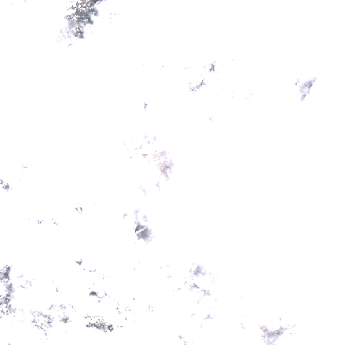

# AFL Basics

AFL (array functional language) is SciDB's native query language. This document
gives a short introduction into the most important operations. For details on individual operations, please also
check the official [manual](https://paradigm4.atlassian.net/wiki/spaces/ESD/pages/19955833/SciDB+Operators#SciDBOperators-IndividualOperatorDocumentation).

The aim of this document is to demonstrate what kind of operations can be performed with
SciDB's built in functionality and where their limitations are. Not all available operators
are discused here. For a complete list, please again check the official [manual](https://paradigm4.atlassian.net/wiki/spaces/ESD/pages/19955833/SciDB+Operators#SciDBOperators-IndividualOperatorDocumentation).


## Example dataset
The explanations below mostly refer to a three-dimensional
example array representing a Sentinel 2 image time series (see below), 
which has 4 attributes (visible and near infrared bands at 10m spatial resolution) 
and 10980 x 10980 pixels from 26 images.



## Getting started with AFL

To see, which arrays are available within the database, the `list()` operator gives some basic information including array schemas. The schema for a specific array can also be queried with the `show()` operator:

```
> show(S2_OKAVANGO_S)
S2_OKAVANGO_S<band1:uint16 NOT NULL,band2:uint16 NOT NULL,band3:uint16 NOT NULL,band4:uint16 NOT NULL> [y=0:10980,2048,0,x=0:10980,2048,0,t=0:*,1,0]
```

The schema holds the following information:

* The array name is S2_OKAVANGO_S.
* The array has 4 attributes (band1, band2, band3, band4) of type uint16 without support for NULL values.
* The array has 3 dimensions y,x, and t.
* y and x dimension values range from 0 to 10980 each, t starts at 0 but is unbounded
* chunks store 2048 x 2048 pixels of the same image
* chunks do not overlap

Operators in general take one or more input arrays and maybe other parameters and produce a single output array. Queries can be nested as in the following typical expression.

The query 
```
> AFL aggregate(filter(apply(S2_OKAVANGO_S, ndvi, (band4 - band3) / (band4 + band3)), ndvi > 0.2), count(*))
```
counts how many Sentinel 2 pixels have an NDVI value greater than 0.2.

Besides `show()`,  further simple operators that help with array metadata are:


* `dimensions` returns details about the array dimensions including the chunk sizes
```
> dimensions(S2_OKAVANGO_S)
{No} name,start,length,chunk_interval,chunk_overlap,low,high,type
{0} 'y',0,10981,2048,0,0,10979,'int64'
{1} 'x',0,10981,2048,0,0,10979,'int64'
{2} 't',0,4611686018427387904,1,0,0,26,'int64'
```


* `attributes` returns details about the array attributes including their data types. 
```
> attributes(S2_OKAVANGO_S)
{No} name,type_id,nullable
{0} 'band1','uint16',false
{1} 'band2','uint16',false
{2} 'band3','uint16',false
{3} 'band4','uint16',false
```


## CRUD operators

Arrays can be created from scratch by specifying a schema without any data, loaded from files, 
or built by expressions.

* `CREATE ARRAY %NAME% %SCHEMA%` creates an empty array with a given schema.
* `load` and `input` read binary or text-formatted (e.g., CSV) files as arrays, and 
* `build` creates one-attribute arrays with data being generated by a simple expression.

For example, `build(<val:double>[y=0:9,10,0, x=0:9,10,0], double(random()) / 2147483647)` creates a two-dimensional array with 10x10 cells where attribute values are random numbers. The result array of the previous query exists only temporarily. To persist it on disk one needs to apply the `store()` operator on the result and specify a name.

Persistent arrays can be exported as files (binary or text-formatted) with `save()` and can be deleted
with `remove()`. The community edition of SciDB does **not** come with user management. Everyone is allowed to
delete all arrays. 

The `insert()` operator finally inserts nonempty cells of a source array to a target array where the array schemas must be compatible.  `merge()` in contrast  similarly combines two arrays but does not overwrite nonempty cells of the target array. In contrast to `merge`, `insert` is a write operator, i.e., data is written directly to a persistent array without explicitly calling `store()`.


## Subsetting

* `between` selects a contiguous region (range / window) of an array specified by lower and upper dimension values. The resulting array has the same schema as the input array but values out of the requested range are empty.
```
> between(S2_OKAVANGO_S, 10,20,6, 12, 21,6)
{y,x,t} band1,band2,band3,band4
{10,20,6} 639,793,949,968
{10,21,6} 641,800,953,995
{11,20,6} 634,801,954,996
{11,21,6} 646,814,947,1034
{12,20,6} 624,793,947,1002
{12,21,6} 644,796,949,1028
```

* `subarray` is equivalent to subarray but moves new lower dimension values to 0 and thus changes the array schema. 
```
> subarray(S2_OKAVANGO_S, 10,20,6, 12, 21,6)
{y,x} val
{y,x,t} band1,band2,band3,band4
{0,0,0} 639,793,949,968
{0,1,0} 641,800,953,995
{1,0,0} 634,801,954,996
{1,1,0} 646,814,947,1034
{2,0,0} 624,793,947,1002
{2,1,0} 644,796,949,1028
```

* `filter` selects array cells by providing a predicate on dimension and or attribute values. The result array has the same schema with cells not fulfilling the predicate being empty.
```
> filter(between(S2_OKAVANGO_S, 0,0,0, 4, 4,26), band4 > 8000)
{y,x,t} band1,band2,band3,band4
{0,0,3} 9169,8892,9285,9211
{0,1,3} 9160,8841,9311,9270
{0,2,3} 9171,8872,9269,9268
{0,3,3} 9223,8881,9253,9264
{0,4,3} 9199,8853,9307,9278
{1,0,3} 9166,8876,9300,9279
{1,1,3} 9177,8854,9282,9255
{1,2,3} 9198,8891,9268,9225
{1,3,3} 9188,8878,9268,9279
{1,4,3} 9202,8873,9287,9273
{2,0,3} 9164,8869,9272,9278
{2,1,3} 9149,8839,9300,9273
{2,2,3} 9208,8841,9306,9262
{2,3,3} 9198,8878,9294,9246
{2,4,3} 9196,8889,9292,9254
{3,0,3} 9171,8846,9261,9263
{3,1,3} 9177,8837,9299,9243
{3,2,3} 9202,8836,9277,9235
{3,3,3} 9203,8856,9286,9253
{3,4,3} 9173,8876,9317,9266
{4,0,3} 9179,8867,9296,9211
{4,1,3} 9180,8878,9278,9208
{4,2,3} 9173,8883,9231,9218
{4,3,3} 9176,8911,9285,9286
{4,4,3} 9199,8889,9263,9277
```

* `project` selects a subset of array attributes 
```
> project(between(S2_OKAVANGO_S, 0,0,0, 4, 4,0), band1, band2)
{y,x,t} band1,band2
{0,0,0} 5118,4959
{0,1,0} 5118,4934
{0,2,0} 5143,4913
{0,3,0} 5123,4912
{0,4,0} 5102,4938
{1,0,0} 5103,4961
{1,1,0} 5097,4946
{1,2,0} 5117,4952
{1,3,0} 5131,4954
{1,4,0} 5137,4962
{2,0,0} 5115,4969
{2,1,0} 5105,4964
{2,2,0} 5112,4952
{2,3,0} 5150,4952
{2,4,0} 5119,4965
{3,0,0} 5129,4977
{3,1,0} 5122,4966
{3,2,0} 5128,4969
{3,3,0} 5145,4966
{3,4,0} 5135,4972
{4,0,0} 5141,4955
{4,1,0} 5119,4963
{4,2,0} 5135,4974
{4,3,0} 5124,4971
{4,4,0} 5153,4969
```


* `slice` selects array cells at a fixed value for one dimension and returns these cells as an array with dimensionally being reduced by one.  
```
> slice(between(S2_OKAVANGO_S, 0,0,0, 4, 4,26), t, 3)
{y,x} band1,band2,band3,band4
{0,0} 9169,8892,9285,9211
{0,1} 9160,8841,9311,9270
{0,2} 9171,8872,9269,9268
{0,3} 9223,8881,9253,9264
{0,4} 9199,8853,9307,9278
{1,0} 9166,8876,9300,9279
{1,1} 9177,8854,9282,9255
{1,2} 9198,8891,9268,9225
{1,3} 9188,8878,9268,9279
{1,4} 9202,8873,9287,9273
{2,0} 9164,8869,9272,9278
{2,1} 9149,8839,9300,9273
{2,2} 9208,8841,9306,9262
{2,3} 9198,8878,9294,9246
{2,4} 9196,8889,9292,9254
{3,0} 9171,8846,9261,9263
{3,1} 9177,8837,9299,9243
{3,2} 9202,8836,9277,9235
{3,3} 9203,8856,9286,9253
{3,4} 9173,8876,9317,9266
{4,0} 9179,8867,9296,9211
{4,1} 9180,8878,9278,9208
{4,2} 9173,8883,9231,9218
{4,3} 9176,8911,9285,9286
{4,4} 9199,8889,9263,9277
```


## Simple arithmetic / logical Expressions
* `apply` is a general operator that adds one or more array attributes by providing arithmetic / logical / other expressions on already existing attributes and dimensions. The following example computes the NDVI vegetation index from the red and near infrared bands.
```
> apply(between(S2_OKAVANGO_S, 0,0,0, 4, 4,0), ndvi, (band4-band3)/(band4+band3))
{y,x,t} band1,band2,band3,band4,ndvi
{0,0,0} 5118,4959,5217,5477,0.0243127
{0,1,0} 5118,4934,5178,5474,0.0277882
{0,2,0} 5143,4913,5170,5429,0.0244363
{0,3,0} 5123,4912,5169,5437,0.0252687
{0,4,0} 5102,4938,5184,5474,0.0272096
{1,0,0} 5103,4961,5201,5481,0.0262123
{1,1,0} 5097,4946,5195,5471,0.0258766
{1,2,0} 5117,4952,5187,5439,0.0237154
{1,3,0} 5131,4954,5167,5449,0.0265637
{1,4,0} 5137,4962,5193,5486,0.027437
{2,0,0} 5115,4969,5170,5467,0.0279214
{2,1,0} 5105,4964,5197,5491,0.0275075
{2,2,0} 5112,4952,5196,5460,0.0247748
{2,3,0} 5150,4952,5182,5464,0.0264888
{2,4,0} 5119,4965,5193,5443,0.0235051
{3,0,0} 5129,4977,5221,5482,0.0243857
{3,1,0} 5122,4966,5198,5463,0.024857
{3,2,0} 5128,4969,5190,5446,0.0240692
{3,3,0} 5145,4966,5201,5504,0.0283045
{3,4,0} 5135,4972,5222,5477,0.023834
{4,0,0} 5141,4955,5237,5488,0.0234033
{4,1,0} 5119,4963,5213,5455,0.0226847
{4,2,0} 5135,4974,5197,5456,0.0243124
{4,3,0} 5124,4971,5208,5478,0.0252667
{4,4,0} 5153,4969,5222,5495,0.0254735
```


## Aggregations

SciDB includes a few functions to aggregate cell values of attributes. These include `aggregate`, `window` and `regrid` as discussed in the following.

* The operator `aggregate` applies a simple aggregation function such as the mean, min, max, or standard deviation over all cells of a specified attribute and optionally groups by dimension values.
```
> aggregate(between(S2_OKAVANGO_S, 0,0,0, 4, 4,26), avg(band1), count(*), min(band1), max(band1))
{i} band1_avg,count,band1_min,band1_max
{0} 1497.38,650,396,9223
```
```
> aggregate(between(S2_OKAVANGO_S, 0,0,0, 4, 4,26), avg(band1), count(*), min(band1), max(band1) , x, y)
{x,y} band1_avg,count,band1_min,band1_max
{0,0} 1535.31,26,411,9169
{0,1} 1515.23,26,409,9166
{0,2} 1502.46,26,406,9164
{0,3} 1508.58,26,422,9171
{0,4} 1507.65,26,464,9179
{1,0} 1524.77,26,396,9160
{1,1} 1503.54,26,397,9177
{1,2} 1487.96,26,408,9149
{1,3} 1498.23,26,432,9177
{1,4} 1505.42,26,497,9180
{2,0} 1507.31,26,401,9171
{2,1} 1486.04,26,410,9198
{2,2} 1476.85,26,418,9208
{2,3} 1485.85,26,448,9202
{2,4} 1519.38,26,510,9173
{3,0} 1496.96,26,409,9223
{3,1} 1474.35,26,410,9188
{3,2} 1472.42,26,422,9198
{3,3} 1481.58,26,470,9203
{3,4} 1499.85,26,519,9176
{4,0} 1497.19,26,404,9199
{4,1} 1493.54,26,423,9202
{4,2} 1489.58,26,449,9196
{4,3} 1482.88,26,472,9173
{4,4} 1481.62,26,509,9199
```
```
> aggregate(between(S2_OKAVANGO_S, 0,0,0, 4, 4,26), avg(band1), count(*), min(band1), max(band1), t)
{t} band1_avg,count,band1_min,band1_max
{0} 5124.84,25,5097,5153
{1} 1077.56,25,1036,1121
{2} 3503.52,25,3459,3552
{3} 9184.04,25,9149,9223
{5} 1167.08,25,1072,1242
{6} 762.12,25,714,804
{7} 2506.64,25,2465,2543
{8} 3691.2,25,2990,4590
{9} 1290.72,25,813,1602
{10} 1172.96,25,801,1669
{11} 591.44,25,531,649
{12} 582.84,25,534,644
{13} 639.92,25,579,725
{14} 509.4,25,464,561
{15} 551.92,25,528,615
{16} 503.8,25,469,638
{17} 514.08,25,467,650
{18} 560.16,25,521,643
{19} 470.32,25,436,565
{20} 460.12,25,427,526
{21} 550.32,25,513,637
{22} 437.6,25,396,529
{23} 1394.36,25,1093,1583
{24} 499.28,25,466,580
{25} 527.04,25,481,654
{26} 658.64,25,594,814
```

* `window` creates a moving window of specified size and aggregates values within the window to derive a new value at the window's center. 
```
> window(between(S2_OKAVANGO_S, 0,0,0, 4, 4,0), 1, 1, 1, 1,0,0, avg(band1), avg(band2), avg(band3), avg(band4))
{y,x,t} band1_avg,band2_avg,band3_avg,band4_avg
{0,0,0} 5109,4950,5197.75,5475.75
{0,1,0} 5116,4944.17,5191.33,5461.83
{0,2,0} 5121.5,4935.17,5177.67,5449.83
{0,3,0} 5125.5,4938.5,5178.33,5452.33
{0,4,0} 5123.25,4941.5,5178.25,5461.5
{1,0,0} 5109.33,4955.5,5193,5476.83
{1,1,0} 5114.22,4950,5190.11,5465.44
{1,2,0} 5121.78,4942.11,5182.33,5457.11
{1,3,0} 5126,4944.44,5182.33,5453.44
{1,4,0} 5127,4947.17,5181.33,5458.83
{2,0,0} 5111.83,4963.83,5197,5475.83
{2,1,0} 5114.22,4961.78,5195,5466.67
{2,2,0} 5123,4957.89,5190.33,5465.22
{2,3,0} 5130.44,4960.44,5192.33,5463.11
{2,4,0} 5136.17,4961.83,5193,5470.5
{3,0,0} 5121.83,4965.67,5206,5474.33
{3,1,0} 5122.89,4965.44,5202.11,5467.56
{3,2,0} 5126.67,4964.11,5198,5468.56
{3,3,0} 5133.44,4965.56,5201.22,5469.22
{3,4,0} 5137.67,4965.83,5204.67,5476.83
{4,0,0} 5127.75,4965.25,5217.25,5472
{4,1,0} 5129,4967.33,5209.33,5465
{4,2,0} 5128.83,4968.17,5201.17,5467
{4,3,0} 5136.67,4970.17,5206.67,5476
{4,4,0} 5139.25,4969.5,5213.25,5488.5
```

* `regrid` partitions array cells into nonoverlapping blocks of specified size and applies an aggregation function to these blocks. Blocks are reduced, i.e., each block will generate one cell in the output array. 
```
> regrid(between(S2_OKAVANGO_S, 0,0,0, 4, 4,0), 2,2,1, avg(band1), avg(band2), avg(band3), avg(band4))
{y,x,t} band1_avg,band2_avg,band3_avg,band4_avg
{0,0,0} 5109,4950,5197.75,5475.75
{0,1,0} 5128.5,4932.75,5173.25,5438.5
{0,2,0} 5119.5,4950,5188.5,5480
{1,0,0} 5117.75,4969,5196.5,5475.75
{1,1,0} 5133.75,4959.75,5192.25,5468.5
{1,2,0} 5127,4968.5,5207.5,5460
{2,0,0} 5130,4959,5225,5471.5
{2,1,0} 5129.5,4972.5,5202.5,5467
{2,2,0} 5153,4969,5222,5495
```


## Reorganizing arrays

Some operators allow to modify the array schema, which e.g., can be useful to optimize the data distribution. 


* `repart` allows to change chunk size, shape, and overlap as in the following.
```
> repart(between(S2_OKAVANGO_S, 0,0,0, 4, 4,0),<band1:uint16 NOT NULL,band2:uint16 NOT NULL,band3:uint16 NOT NULL,band4:uint16 NOT NULL> [y=0:10980,256,0,x=0:10980,256,0,t=0:*,27,0])
{y,x,t} band1,band2,band3,band4
{0,0,0} 5118,4959,5217,5477
{0,1,0} 5118,4934,5178,5474
{0,2,0} 5143,4913,5170,5429
{0,3,0} 5123,4912,5169,5437
{0,4,0} 5102,4938,5184,5474
{1,0,0} 5103,4961,5201,5481
{1,1,0} 5097,4946,5195,5471
{1,2,0} 5117,4952,5187,5439
{1,3,0} 5131,4954,5167,5449
{1,4,0} 5137,4962,5193,5486
{2,0,0} 5115,4969,5170,5467
{2,1,0} 5105,4964,5197,5491
{2,2,0} 5112,4952,5196,5460
{2,3,0} 5150,4952,5182,5464
{2,4,0} 5119,4965,5193,5443
{3,0,0} 5129,4977,5221,5482
{3,1,0} 5122,4966,5198,5463
{3,2,0} 5128,4969,5190,5446
{3,3,0} 5145,4966,5201,5504
{3,4,0} 5135,4972,5222,5477
{4,0,0} 5141,4955,5237,5488
{4,1,0} 5119,4963,5213,5455
{4,2,0} 5135,4974,5197,5456
{4,3,0} 5124,4971,5208,5478
{4,4,0} 5153,4969,5222,5495
```


* `redimension` is an extremely powerful operator that includes functionality of `repart` but can also convert attributes to dimensions or vice versa if possible and change dimensions start / end indexes. This is extremely useful in data integration or statistical analysis where high-dimensional data often needs to be converted to observation matrices for following linear algebra operations (e.g. PCA). A detailed example is omitted here but can be found at the official documentation.


* `unpack` reduces a multidimensional array to a one-dimensional array with new artificial dimension (sequence). The result can be seen as a long table of the data.
```
> unpack(between(S2_OKAVANGO_S, 0,0,0, 4, 4,0), i)
{i} y,x,t,band1,band2,band3,band4
{0} 0,0,0,5118,4959,5217,5477
{1} 0,1,0,5118,4934,5178,5474
{2} 0,2,0,5143,4913,5170,5429
{3} 0,3,0,5123,4912,5169,5437
{4} 0,4,0,5102,4938,5184,5474
{5} 1,0,0,5103,4961,5201,5481
{6} 1,1,0,5097,4946,5195,5471
{7} 1,2,0,5117,4952,5187,5439
{8} 1,3,0,5131,4954,5167,5449
{9} 1,4,0,5137,4962,5193,5486
{10} 2,0,0,5115,4969,5170,5467
{11} 2,1,0,5105,4964,5197,5491
{12} 2,2,0,5112,4952,5196,5460
{13} 2,3,0,5150,4952,5182,5464
{14} 2,4,0,5119,4965,5193,5443
{15} 3,0,0,5129,4977,5221,5482
{16} 3,1,0,5122,4966,5198,5463
{17} 3,2,0,5128,4969,5190,5446
{18} 3,3,0,5145,4966,5201,5504
{19} 3,4,0,5135,4972,5222,5477
{20} 4,0,0,5141,4955,5237,5488
{21} 4,1,0,5119,4963,5213,5455
{22} 4,2,0,5135,4974,5197,5456
{23} 4,3,0,5124,4971,5208,5478
{24} 4,4,0,5153,4969,5222,5495
```


* `unfold` adds one dimension to an existing array, which represents the attribute number. The result has only one attribute.
```
unfold(between(S2_OKAVANGO_S, 0,0,0, 4, 4,0))
{y,x,t,unfold_3} band1
{0,0,0,0} 5118
{0,0,0,1} 4959
{0,0,0,2} 5217
{0,0,0,3} 5477
{0,1,0,0} 5118
{0,1,0,1} 4934
{0,1,0,2} 5178
{0,1,0,3} 5474
{0,2,0,0} 5143
{0,2,0,1} 4913
{0,2,0,2} 5170
{0,2,0,3} 5429
{0,3,0,0} 5123
{0,3,0,1} 4912
{0,3,0,2} 5169
{0,3,0,3} 5437
{0,4,0,0} 5102
{0,4,0,1} 4938
{0,4,0,2} 5184
{0,4,0,3} 5474
{1,0,0,0} 5103
{1,0,0,1} 4961
{1,0,0,2} 5201
{1,0,0,3} 5481
{1,1,0,0} 5097
{1,1,0,1} 4946
{1,1,0,2} 5195
{1,1,0,3} 5471
{1,2,0,0} 5117
{1,2,0,1} 4952
{1,2,0,2} 5187
{1,2,0,3} 5439
{1,3,0,0} 5131
{1,3,0,1} 4954
{1,3,0,2} 5167
{1,3,0,3} 5449
{1,4,0,0} 5137
{1,4,0,1} 4962
{1,4,0,2} 5193
{1,4,0,3} 5486
{2,0,0,0} 5115
{2,0,0,1} 4969
{2,0,0,2} 5170
{2,0,0,3} 5467
{2,1,0,0} 5105
{2,1,0,1} 4964
{2,1,0,2} 5197
{2,1,0,3} 5491
{2,2,0,0} 5112
{2,2,0,1} 4952
{2,2,0,2} 5196
{2,2,0,3} 5460
{2,3,0,0} 5150
{2,3,0,1} 4952
{2,3,0,2} 5182
{2,3,0,3} 5464
{2,4,0,0} 5119
{2,4,0,1} 4965
{2,4,0,2} 5193
{2,4,0,3} 5443
{3,0,0,0} 5129
{3,0,0,1} 4977
{3,0,0,2} 5221
{3,0,0,3} 5482
{3,1,0,0} 5122
{3,1,0,1} 4966
{3,1,0,2} 5198
{3,1,0,3} 5463
{3,2,0,0} 5128
{3,2,0,1} 4969
{3,2,0,2} 5190
{3,2,0,3} 5446
{3,3,0,0} 5145
{3,3,0,1} 4966
{3,3,0,2} 5201
{3,3,0,3} 5504
{3,4,0,0} 5135
{3,4,0,1} 4972
{3,4,0,2} 5222
{3,4,0,3} 5477
{4,0,0,0} 5141
{4,0,0,1} 4955
{4,0,0,2} 5237
{4,0,0,3} 5488
{4,1,0,0} 5119
{4,1,0,1} 4963
{4,1,0,2} 5213
{4,1,0,3} 5455
{4,2,0,0} 5135
{4,2,0,1} 4974
{4,2,0,2} 5197
{4,2,0,3} 5456
{4,3,0,0} 5124
{4,3,0,1} 4971
{4,3,0,2} 5208
{4,3,0,3} 5478
{4,4,0,0} 5153
{4,4,0,1} 4969
{4,4,0,2} 5222
{4,4,0,3} 5495
```


## Joins

Previous operators worked on single arrays only. The exceptions `merge` and `insert` combined arrays with the same schema (dimensions and attributes). The following operations join arrays in a more flexible way. 


* `join` combines the attributes of two arrays with equal dimensions. Cells of the result array include the attributes from both input arrays. 

* `cross_join` combines arrays with different dimensions by manually specifying which dimensioan pairs must match. For instance, this allows to join a three-dimensional space time array (as from Earth observation) with a two-dimensional spatial array (such as an elevation model). 


## Linear algebra

* `gemm` runs a distributed matrix multiplication using ScaLAPACK 
* `gesvd` runs a distributed singular value decomposition using ScaLAPACK


